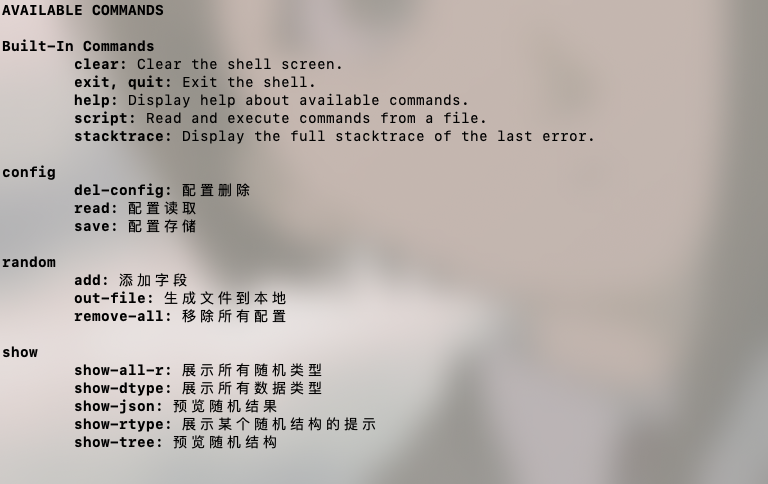
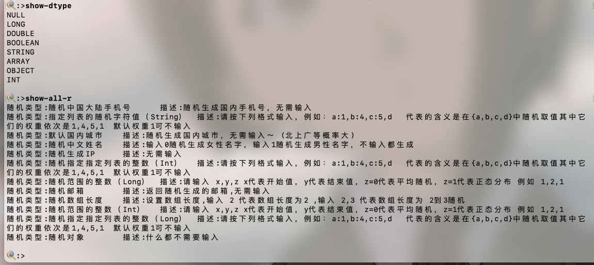

# CLI 客户端快速使用

CLI 客户端基本功能和WEB保持一致，为喜欢命令行的朋友提供了另一种选择。

## 开始之前

如果你还没有安装，请前往[安装](../setup/index.md)

## 基本介绍

### 启动


如上图，命令分为了4个组



### **Built-In Commands**

spring shell 框架自带的一些命令

+  **clear**: Clear the shell screen.
+ **exit, quit**: Exit the shell.
+ **help**: Display help about available commands.
+ **script**: Read and execute commands from a file.
+ **stacktrace**: Display the full stacktrace of the last error.

### **config**

对应WEB的配置功能，分别是删除，读取，存储。参数都是name

+ **del-config**: 配置删除

+ **read**: 配置读取

+ **save**: 配置存储

### **random**

造数配置

+ **add**: 添加字段

+ **out-file**: 生成文件到本地

+ **remove-all**: 移除所有配置

### **show**

一些预览展示

+ **show-all-r**: 展示所有随机类型
+ **show-dtype**: 展示所有数据类型
+ **show-json**: 预览随机结果
+ **show-rtype**: 展示某个随机结构的提示
+ **show-tree**: 预览随机结构

## 一个例子

> 背景描述：造一批json，这批json有3个字段，分别是name,age,citys，其中citys是一个数组，里面的值是城市名。

我们先看看有哪些类型吧



我们看看 'add'命令需要的参数

```shell
🍭:>help add

NAME
	add - 添加字段

SYNOPSYS
	add [--field] string  [--father] string  [--dtype] string  [--rtype] string  [[--input] string]  

OPTIONS
	--field  string
		
		[Mandatory]

	--father  string
		
		[Mandatory]

	--dtype  string
		
		[Mandatory]

	--rtype  string
		
		[Mandatory]

	--input  string
		
		[Optional, default = ]
```

+ filed 为字段名
+ father 为父节点名
+ dtype  为数据类型
+ rtype 为随机类型
+ input 为随机类型的配置输入

接下来，我们添加背景描述的字段


我们可以预览字段结构和生成结果：


保存结果


配置的存储


## 其它

命令支持tab补全哦。
