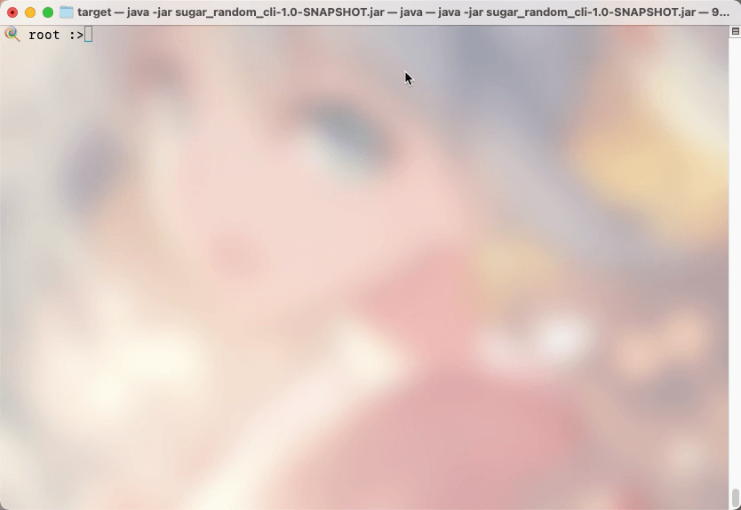
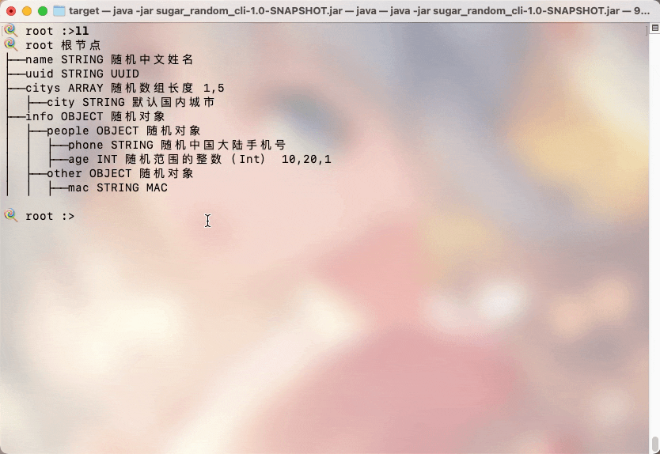
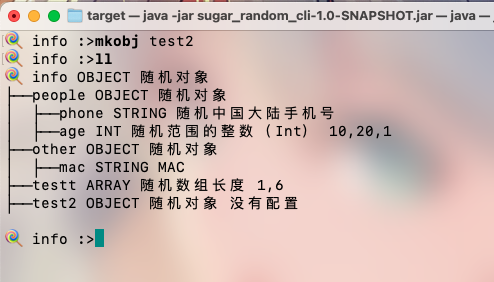
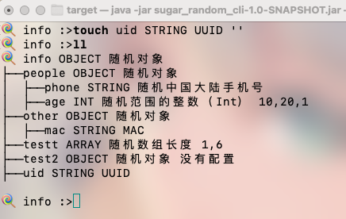
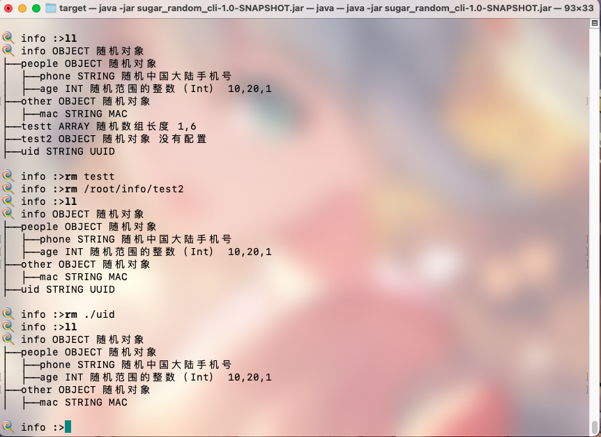
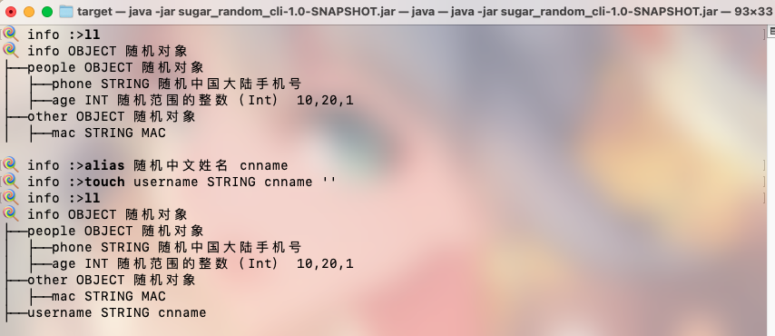

# CLI 新版命令

> 老版的命令暂时和新版的命令共存，新版的命令风格模仿unix 文件的命令。文件系统是一颗树，json也是一颗树，所以这套命令应该比较容易上手。

## 命令概述

+ **cd**: 进入到某个节点

+ **ll**: 展示结构
+ **pwd**: 当前节点路径
+ **alias**: 别名，仅针对随机类型名，会覆盖，优先级大于随机类型名

+ **mkarr**: 添加一个数组，input 参考 [show-rtype 随机数组长度]

+ **mkobj**: 添加一个object

+ **rm**: 删除

+ **touch**: 添加字段

## 详细说明

### cd、ll、pwd

> 这个大家应该很熟悉了，支持绝对路径和相对路径



### mkarr

建立一个数组 参数是数组名和数组长度配置。

```shell
🍭 root :>help mkarr 
NAME
	mkarr - 添加一个数组，input 参考 [show-rtype 随机数组长度]

SYNOPSYS
	mkarr [--name] string  [--input] string  

OPTIONS
	--name  string
		
		[Mandatory]

	--input  string
		
		[Mandatory]
```

例如下面演示了在info下建立一个数组



### mkobj

建立一个对象，参数只有一个对象名字。



### touch

和老版的 add 命令类似，与add相比少了一个father，因为father就是当前“目录”。



### rm

支持绝对路径和相对路径



### alias

> 考虑到随机类型过于长，所以支持别名。（目前还没有想好怎么优化



## 其它

其它的命令如show系列，请看[老版文档](quick_cli.md)，目前命令是共存的。

