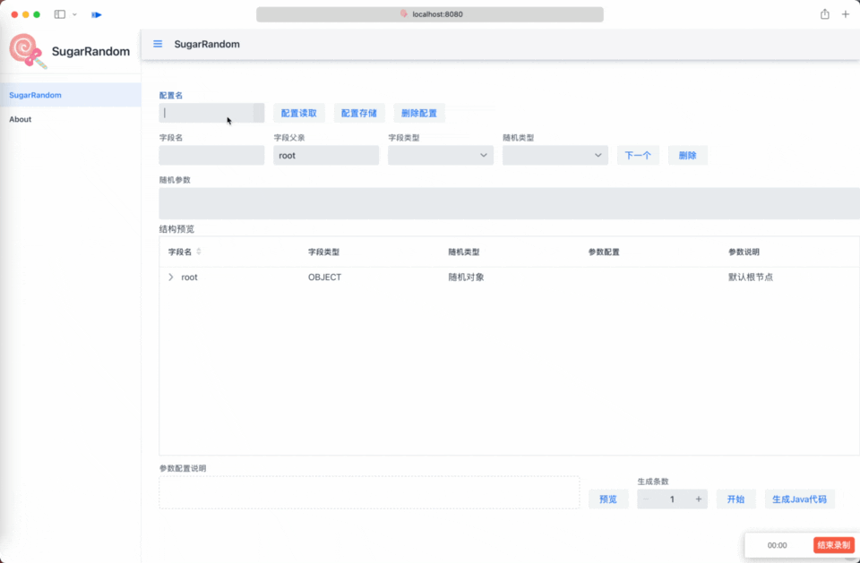

# 生成代码

> 生成造数的Java Code，理论上其他JVM语言也可以用
> 文档截图可能会与现有版本有细微差别，不影响教程。

⚠️目前依赖在GitHub package，并没有在中央仓库。[github 仓库使用参考](https://docs.github.com/en/packages/working-with-a-github-packages-registry/working-with-the-apache-maven-registry)

## 使用
直接点击`生成Java代码`按钮即可。

如下图：

## 注意事项

+ **请手动修改 依赖版本为你使用的版本**

+ **使用方式参考 生成代码的main方法**

